## Il gap che nessun unit test può colmare

I test unitari mi dicevano che andava tutto bene, eppure le lamentele degli utenti continuavano ad arrivare.

Mancava un tassello: non ci siamo immedesimati negli utenti. Ci siamo focalizzati sulla copertura della codebase, non su cosa gli utenti sperimentano quando usano il prodotto.

Questo è esattamente il gap che il **testing End-to-End (E2E)** colma.

## Cos'è il Testing E2E

Il testing E2E simula il comportamento di un utente reale: apre un browser, naviga le pagine, clicca sui bottoni, compila form, e verifica che tutto funzioni come previsto.

A differenza dei test unitari (che testano singole funzioni) o dei test di integrazione (che verificano la comunicazione tra moduli), i test E2E validano l'**intera applicazione** dal punto di vista dell'utente finale.

### Vantaggi

- **Confidenza**: Stai testando esattamente ciò che l'utente sperimenta
- **Copertura reale**: Verifichi l'integrazione di frontend, backend, database e servizi esterni
- **Protezione del business**: I flussi critici (login, checkout, pagamenti) sono garantiti

### Perché molti team li evitano

I test E2E fanno paura. E non senza motivo.

**"Richiedono troppo tempo"** — C'è la percezione che scrivere test E2E sia un investimento enorme, tempo sottratto allo sviluppo di feature. E in effetti, se l'approccio è sbagliato, lo è.

**"Sono difficili da mantenere"** — L'interfaccia cambia, i test si rompono, nessuno ha voglia di sistemarli. Diventano quel task che si rimanda sempre.

**"Non sappiamo da dove iniziare"** — Quali flussi testare? Come strutturare i test? Dove metterli nella pipeline? L'assenza di una strategia chiara paralizza.

**"Abbiamo già i test unitari"** — Il falso senso di sicurezza della copertura al 80%. Se il codice è testato, l'applicazione funziona. Giusto? No.

Il risultato? Molti team non iniziano mai, oppure abbandonano dopo i primi tentativi falliti.

Ma gli strumenti sono cambiati. E con loro, le regole del gioco.

## Playwright: Un cambio di paradigma

Playwright, sviluppato da Microsoft, ha cambiato le regole del gioco. Non è solo un altro framework di testing: è un ripensamento completo di come dovrebbero funzionare i test E2E.

### I tre pilastri

**1. Affidabilità (Auto-Waiting)**

Playwright aspetta automaticamente che gli elementi siano visibili, stabili e interattivi prima di agire:

```javascript
// Con Playwright - niente sleep, niente "speriamo"
await page.getByRole('button', { name: 'Acquista' }).click();
```

Playwright sa quando l'elemento è pronto. Se il bottone appare dopo 100ms o dopo 2 secondi, non importa: il test funziona in entrambi i casi.

**2. Velocità (Parallelizzazione nativa)**

I test girano in parallelo con isolamento completo. Ogni test ha il suo browser context, eliminando interferenze tra test. Il risultato? Suite che giravano in 10 minuti ora completano in 2.

**3. Developer Experience**

Una singola API per Chromium, Firefox e WebKit. Setup in un comando:

```bash
npm init playwright@latest
```

E strumenti che rendono il debugging un piacere invece che un incubo.

## Gli strumenti che fanno la differenza

### Codegen: Registra, non scrivere

```bash
npx playwright codegen tuosito.com
```

Playwright registra le tue azioni nel browser e genera il codice corrispondente. Perfetto per iniziare rapidamente o per flussi complessi.

### UI Mode: Debugging visuale

```bash
npx playwright test --ui
```

Un'interfaccia grafica dove puoi eseguire test singolarmente, vedere lo stato del DOM in ogni step, e ispezionare cosa è andato storto.

### Trace Viewer: L'autopsia dei test falliti

Quando un test fallisce in CI, il Trace Viewer ti mostra esattamente cosa è successo: screenshot, network requests, console logs, DOM snapshots. Tutto in un unico file che puoi aprire nel browser.

## Un primo test concreto

```javascript
import { test, expect } from '@playwright/test';

test('utente completa un acquisto', async ({ page }) => {
  // Naviga alla home
  await page.goto('https://shop.example.com');

  // Cerca un prodotto
  await page.getByPlaceholder('Cerca prodotti...').fill('laptop');
  await page.getByRole('button', { name: 'Cerca' }).click();

  // Aggiungi al carrello
  await page.getByTestId('product-card').first().click();
  await page.getByRole('button', { name: 'Aggiungi al carrello' }).click();

  // Verifica
  await expect(page.getByTestId('cart-count')).toHaveText('1');
});
```

Nota come i selettori siano **semantici**: `getByRole`, `getByPlaceholder`, `getByTestId`. Questo rende i test resistenti ai cambiamenti di stile e struttura HTML.

## Quando usare i test E2E

I test E2E non sostituiscono unit e integration test. La **piramide dei test** resta valida: molti unit test veloci alla base, meno integration test al centro, pochi E2E mirati in cima.

Usa i test E2E per:
- Flussi critici di business (registrazione, checkout, pagamenti)
- Smoke test dopo ogni deploy
- Regressioni su funzionalità core

Non usarli per:
- Testare ogni edge case (usa unit test)
- Validare logica di business isolata
- Coprire il 100% del codice

## Inizia oggi

Se non hai mai scritto test E2E, o se li hai abbandonati per frustrazione, Playwright merita una seconda chance. La curva di apprendimento è sorprendentemente dolce, e i benefici sono immediati.

```bash
# Tutto quello che serve per iniziare
npm init playwright@latest
npx playwright test
```

Il tuo futuro te stesso (e il tuo team) ti ringrazieranno la prossima volta che un deploy non romperà la produzione.

---

*Vuoi approfondire? La documentazione ufficiale di Playwright (playwright.dev) è eccellente, e la community su Discord è attiva e disponibile.*

---

<!--
===============================================
GRAFICHE SUGGERITE
===============================================

1. HERO IMAGE (apertura articolo)
   - Opzione A: Split screen browser con test verde a sinistra / errore in produzione a destra
   - Opzione B: Illustrazione minimalista di un robot che testa un'interfaccia
   - Opzione C: Screenshot stilizzato di Playwright UI Mode in azione
   Posizione: subito dopo il titolo

2. PIRAMIDE DEI TEST
   Grafica classica con tre livelli:
        /\
       /E2E\        ← Pochi, mirati, lenti
      /------\
     /Integration\   ← Moderati
    /--------------\
   /   Unit Tests   \ ← Molti, veloci
  /------------------\

   Suggerimento: evidenzia E2E in colore diverso (es. blu/viola)
   Posizione: sezione "Cos'è il Testing E2E"

3. CONFRONTO SELENIUM VS PLAYWRIGHT (tabella visiva)
   Due colonne con icone X rossa vs check verde:

   | Selenium          | Playwright        |
   |-------------------|-------------------|
   | sleep(3000)       | Auto-waiting      |
   | Setup manuale     | npm init          |
   | Flaky tests       | Retry automatico  |
   | Multi-driver      | API unificata     |

   Posizione: sezione "Le sfide storiche" o "Playwright: Un cambio di paradigma"

4. I 3 PILASTRI (card orizzontali)
   Tre card affiancate con icone:

   [Scudo/Target]        [Fulmine/Razzo]      [Bacchetta/Cuore]
   AFFIDABILITA'         VELOCITA'            SEMPLICITA'
   Auto-waiting          Parallelizzazione    Una API, tutti
   Zero flaky tests      4x più veloce        i browser

   Posizione: sezione "I tre pilastri"

5. SCREENSHOT STRUMENTI
   - Codegen: GIF animata o screenshot del browser con pannello codice generato a fianco
   - UI Mode: Screenshot dell'interfaccia con test list + browser + timeline
   - Trace Viewer: Screenshot della timeline con network/console/DOM snapshots

   Posizione: sezione "Gli strumenti che fanno la differenza"

6. FLUSSO TEST (diagramma orizzontale)
   Stile flowchart con icone per ogni step:

   [Browser]  →  [Lente]  →  [Click]  →  [Carrello]  →  [Check]
    Naviga       Cerca      Seleziona    Aggiungi     Verifica

   Posizione: sezione "Un primo test concreto"

7. QUANDO USARE E2E (checklist visiva)
   Due colonne:

   ✓ USA PER:                    ✗ NON USARE PER:
   • Flussi critici              • Ogni edge case
   • Smoke test post-deploy      • Logica isolata
   • Regressioni core            • 100% coverage

   Posizione: sezione "Quando usare i test E2E"

===============================================
RISORSE PER CREARE LE GRAFICHE
===============================================

- Excalidraw (excalidraw.com) - diagrammi sketch-style
- Figma - design professionale
- Canva - template pronti
- Carbon (carbon.now.sh) - screenshot codice stilizzati
- Mermaid - diagrammi da markdown
- Draw.io - flowchart classici

===============================================
DIAGRAMMI MERMAID PRONTI ALL'USO
===============================================

=== 1. PIRAMIDE DEI TEST ===

```mermaid
%%{init: {'theme': 'base', 'themeVariables': { 'primaryColor': '#6366f1', 'secondaryColor': '#f1f5f9', 'tertiaryColor': '#fff'}}}%%
graph TB
    subgraph pyramid[" "]
        E2E["🎯 E2E Tests<br/><small>Pochi, mirati, lenti</small>"]
        INT["🔗 Integration Tests<br/><small>Moderati</small>"]
        UNIT["⚡ Unit Tests<br/><small>Molti, veloci</small>"]
    end

    E2E --> INT --> UNIT

    style E2E fill:#6366f1,stroke:#4f46e5,color:#fff
    style INT fill:#8b5cf6,stroke:#7c3aed,color:#fff
    style UNIT fill:#a78bfa,stroke:#8b5cf6,color:#fff
```


=== 2. CONFRONTO SELENIUM VS PLAYWRIGHT ===

```mermaid
%%{init: {'theme': 'base'}}%%
graph LR
    subgraph selenium["❌ Selenium"]
        S1["sleep(3000)"]
        S2["Setup manuale driver"]
        S3["Flaky tests"]
        S4["API diverse per browser"]
    end

    subgraph playwright["✅ Playwright"]
        P1["Auto-waiting"]
        P2["npm init playwright"]
        P3["Retry automatico"]
        P4["Una API unificata"]
    end

    style selenium fill:#fee2e2,stroke:#ef4444
    style playwright fill:#dcfce7,stroke:#22c55e
    style S1 fill:#fecaca,stroke:#f87171
    style S2 fill:#fecaca,stroke:#f87171
    style S3 fill:#fecaca,stroke:#f87171
    style S4 fill:#fecaca,stroke:#f87171
    style P1 fill:#bbf7d0,stroke:#4ade80
    style P2 fill:#bbf7d0,stroke:#4ade80
    style P3 fill:#bbf7d0,stroke:#4ade80
    style P4 fill:#bbf7d0,stroke:#4ade80
```


=== 3. I TRE PILASTRI DI PLAYWRIGHT ===

```mermaid
%%{init: {'theme': 'base'}}%%
graph TB
    PW["🎭 PLAYWRIGHT"]

    subgraph pillar1["🎯 Affidabilità"]
        A1["Auto-waiting intelligente"]
        A2["Web-first assertions"]
        A3["Zero flaky tests"]
    end

    subgraph pillar2["⚡ Velocità"]
        B1["Parallelizzazione nativa"]
        B2["Browser context isolati"]
        B3["4x più veloce"]
    end

    subgraph pillar3["🎨 Semplicità"]
        C1["Una API per tutti i browser"]
        C2["Setup in 1 comando"]
        C3["Tooling eccezionale"]
    end

    PW --> pillar1
    PW --> pillar2
    PW --> pillar3

    style PW fill:#6366f1,stroke:#4f46e5,color:#fff
    style pillar1 fill:#dbeafe,stroke:#3b82f6
    style pillar2 fill:#fef3c7,stroke:#f59e0b
    style pillar3 fill:#d1fae5,stroke:#10b981
```


=== 4. FLUSSO TEST E-COMMERCE ===

```mermaid
%%{init: {'theme': 'base'}}%%
graph LR
    A["🌐<br/>Naviga"]
    B["🔍<br/>Cerca"]
    C["👆<br/>Seleziona"]
    D["🛒<br/>Aggiungi"]
    E["✅<br/>Verifica"]

    A --> B --> C --> D --> E

    style A fill:#e0e7ff,stroke:#6366f1
    style B fill:#ddd6fe,stroke:#8b5cf6
    style C fill:#f3e8ff,stroke:#a855f7
    style D fill:#fae8ff,stroke:#c026d3
    style E fill:#dcfce7,stroke:#22c55e
```


=== 5. QUANDO USARE E2E ===

```mermaid
%%{init: {'theme': 'base'}}%%
graph TB
    subgraph usa["✅ USA PER"]
        U1["Flussi critici di business"]
        U2["Smoke test post-deploy"]
        U3["Regressioni su feature core"]
        U4["Cross-browser testing"]
    end

    subgraph nousa["❌ NON USARE PER"]
        N1["Testare ogni edge case"]
        N2["Validare logica isolata"]
        N3["Raggiungere 100% coverage"]
        N4["Test di performance"]
    end

    style usa fill:#dcfce7,stroke:#22c55e
    style nousa fill:#fee2e2,stroke:#ef4444
    style U1 fill:#bbf7d0,stroke:#4ade80
    style U2 fill:#bbf7d0,stroke:#4ade80
    style U3 fill:#bbf7d0,stroke:#4ade80
    style U4 fill:#bbf7d0,stroke:#4ade80
    style N1 fill:#fecaca,stroke:#f87171
    style N2 fill:#fecaca,stroke:#f87171
    style N3 fill:#fecaca,stroke:#f87171
    style N4 fill:#fecaca,stroke:#f87171
```


=== 6. ARCHITETTURA PLAYWRIGHT ===

```mermaid
%%{init: {'theme': 'base'}}%%
graph TB
    TEST["📝 Test Script"]
    PW["🎭 Playwright API"]

    subgraph browsers["Browser Engines"]
        CR["🔵 Chromium"]
        FF["🟠 Firefox"]
        WK["🔴 WebKit"]
    end

    subgraph tools["Developer Tools"]
        CG["📹 Codegen"]
        UI["🖥️ UI Mode"]
        TR["📊 Trace Viewer"]
    end

    TEST --> PW
    PW --> CR
    PW --> FF
    PW --> WK
    PW --> tools

    style TEST fill:#fef3c7,stroke:#f59e0b
    style PW fill:#6366f1,stroke:#4f46e5,color:#fff
    style browsers fill:#f1f5f9,stroke:#64748b
    style tools fill:#f0fdf4,stroke:#22c55e
```


=== 7. CICLO DI VITA DEL TEST ===


=== 8. STRATEGIA SELETTORI (dal più al meno consigliato) ===

```mermaid
%%{init: {'theme': 'base'}}%%
graph TB
    subgraph best["✅ CONSIGLIATI"]
        R["getByRole()"]
        L["getByLabel()"]
        P["getByPlaceholder()"]
        T["getByText()"]
        TI["getByTestId()"]
    end

    subgraph avoid["⚠️ EVITARE"]
        CSS["CSS Selectors"]
        XP["XPath"]
        ID["#id fragili"]
    end

    R --> L --> P --> T --> TI --> CSS --> XP --> ID

    style best fill:#dcfce7,stroke:#22c55e
    style avoid fill:#fef3c7,stroke:#f59e0b
    style R fill:#bbf7d0,stroke:#4ade80
    style L fill:#bbf7d0,stroke:#4ade80
    style P fill:#bbf7d0,stroke:#4ade80
    style T fill:#bbf7d0,stroke:#4ade80
    style TI fill:#bbf7d0,stroke:#4ade80
    style CSS fill:#fef08a,stroke:#eab308
    style XP fill:#fed7aa,stroke:#f97316
    style ID fill:#fecaca,stroke:#f87171
```


===============================================
-->
